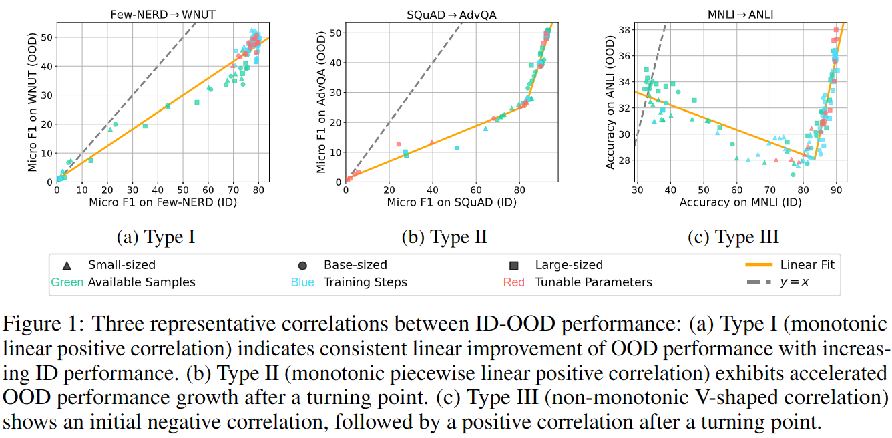

This reposition contains code and data for paper "[Revisiting Out-of-distribution Robustness in NLP: Benchmarks, Analysis, and LLMs Evaluations](https://openreview.net/forum?id=zQU33Uh3qM)".

# Datasets

Our OOD benchmark covers five representative NLP tasks, including one ID dataset and three corresponding OOD datasets for each task. The datasets can be downloaded [HERE](https://drive.google.com/file/d/1CMt3hTAxt88PuNZKHoAIKB68AcQ38U6f/view?usp=sharing), and you can place them in `./datasets/process`. 

**Note**: As required by the authors, you should first fill the forms to access Implicit Hate [[form]](https://forms.gle/QxCpEbVp91Z35hWFA) and ToxiGen [[form]](https://forms.office.com/r/r6VXX8f8vh). Link to their official repositories: [Implicit Hate](https://github.com/SALT-NLP/implicit-hate); [ToxiGen](https://github.com/microsoft/TOXIGEN).

# Dataset Selection
We select the datasets based on three principles:
1. The ID dataset should provide sufficient knowledge for models to handle the task.
2. Datasets within a given task should originate from diverse distributions for a holistic evaluation.
3. OOD shifts should be challenging to provide an accurate assessment of progress in OOD robustness.

To reproduce our dataset selection process, you should first obtain all candidate datasets considered in our paper. Please refer the markdown files in `./datasets` for instructions of downloading the original datasets, and organize them in `./datasets/raw` by tasks. Then, you can run the code in `./src/dataset_processing` to process the datasets. For example, you can process the amazon dataset by running: 
```
python ./src/dataset_processing/SentimentAnalysis/amazon.py
``` 
The processed datasets will be stored in `./datasets/process`.

Upon processing all candidate datasets, run `python ./src/dataset_selection/stat.py` for statistics of the datasets. We determine the ID datasets based on the dataset source and size. Then, for principle 2, we compute semantic similarity between dataset pairs using SimCSE, by running:
```
python ./src/dataset_selection/simcse.py
```
The results of the two programs will be stored in `./results/dataset_selection/statistics` and `./results/dataset_selection/simcse`, respectively. Finally, according to principle 3, we should train models on the ID datasets and test them on corresponding OOD datasets. This can be done by uncomment the lines with `--method vanilla` in `./scripts/run_method.sh`, and then run the file by `sh ./scripts/run_method.sh`.

# Analysis
We analyze the relationship between ID-OOD performance of PLMs under vanilla fine-tuning. To obatin data points, we manipulate four factors, i.e. model scale, training steps, available training samples, and tunable parameter, to fine-tune models. Please refer to `./src/analysis` for the code. The commands for running experiments are shown in `./scripts/run_shots.sh`, `./scripts/run_steps.sh`, and `./scripts/run_peft.sh`.



# Evaluation
We also evaluate the effectiveness of existing robustness-enhanced methods and the performance of LLMs on our benchmark. Run `sh ./scripts/run_method.sh` to reproduce the assessment of robustness-enhanced methods, and `python llm.py --model_name MODEL_NAME --setting SETTING` to reproduce the evaluation of LLMs. `MODEL_NAME` should be one of `turbo`, `davinci3`, and `llama`, and `SETTING` should be one of `zero-shot`, `in-context`, and `ood-in-context`

Note that the evaluation for `davinci3` (text-davinci-003) and `turbo` (gpt-3.5-turbo) requires OpenAI API key, so you should first set your key in `./api.key` beforehand. Run `echo YOUR_KEY > ./api.key` or directly enter your key in the first line of `./api.key`.

<!-- # Citation
If you find our code or data useful, please cite our paper:
```

``` -->